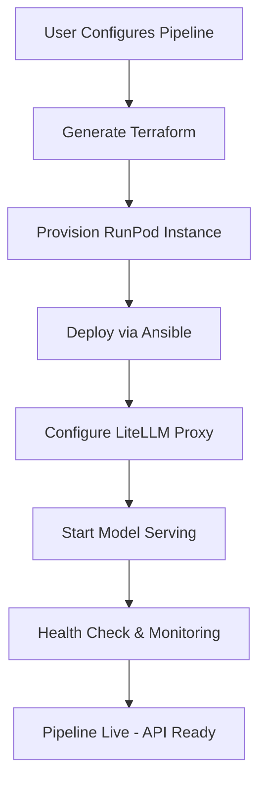

# 🚀 MLOps No-Code Pipeline Orchestrator - ARCHITECTURE COMPLÈTE

## 📋 EXECUTIVE SUMMARY
Plateforme révolutionnaire permettant le déploiement de pipelines ML complexes via interface drag&drop, avec déploiement automatisé sur infrastructure cloud en <5 minutes.

---

## 🏗️ ARCHITECTURE BLUEPRINT

### 🎯 STACK ARCHITECTURE OVERVIEW
```
┌─────────────────────────────────────────────────────────────┐
│                     USER INTERFACE LAYER                    │
├─────────────────────────────────────────────────────────────┤
│  React Flow UI  │  n8n Visual Editor  │  Monitoring Dashboard │
└─────────────────────────────────────────────────────────────┘
                               │
┌─────────────────────────────────────────────────────────────┐
│                    ORCHESTRATION LAYER                      │
├─────────────────────────────────────────────────────────────┤
│  n8n Workflows  │  Windmill Scripts  │  FastAPI Gateway      │
└─────────────────────────────────────────────────────────────┘
                               │
┌─────────────────────────────────────────────────────────────┐
│                   INFRASTRUCTURE LAYER                      │
├─────────────────────────────────────────────────────────────┤
│  Terraform IaC  │  Ansible Playbooks │  K8s Orchestration   │
└─────────────────────────────────────────────────────────────┘
                               │
┌─────────────────────────────────────────────────────────────┐
│                     COMPUTE LAYER                           │
├─────────────────────────────────────────────────────────────┤
│   RunPod.io API   │   Vast.ai API    │   Local K3s Cluster  │
└─────────────────────────────────────────────────────────────┘
```

### 🔧 CORE COMPONENTS DÉTAILLÉS

#### 1. **Frontend No-Code Interface**
```typescript
// React Flow + Custom Nodes
interface PipelineNode {
  id: string;
  type: 'data_source' | 'preprocessing' | 'model' | 'deployment';
  config: NodeConfig;
  position: { x: number; y: number };
}

// Composants disponibles :
- Data Source Nodes (S3, Database, API)
- Preprocessing Nodes (Feature Engineering, Normalization)
- Model Nodes (Training, Fine-tuning, Inference)
- Deployment Nodes (API Endpoint, Batch Processing)
```

#### 2. **Orchestration Engine (n8n + Windmill)**
```yaml
# Pipeline Workflow Template
pipeline_workflow:
  name: "ML Pipeline Deployment"
  trigger: "manual"
  steps:
    - name: "validate_config"
      type: "windmill_script"
      script: "pipeline_validator.ts"
    
    - name: "generate_infrastructure"
      type: "terraform_generator"
      output: "infrastructure.tf"
    
    - name: "provision_compute"
      type: "runpod_api"
      action: "create_pod"
    
    - name: "deploy_pipeline"
      type: "ansible_playbook"
      playbook: "deploy_ml_pipeline.yml"
```

#### 3. **Infrastructure as Code Generator**
```hcl
# Terraform Template Dynamique
resource "runpod_pod" "ml_pipeline" {
  name = var.pipeline_name
  image_name = var.docker_image
  
  gpu_type = var.gpu_type
  gpu_count = var.gpu_count
  
  container_disk_in_gb = var.disk_size
  volume_in_gb = var.storage_size
  
  env = {
    MODEL_PATH = var.model_path
    API_PORT = var.api_port
    REDIS_URL = var.redis_url
  }
}
```

#### 4. **Backend API Gateway (FastAPI)**
```python
# Core API Structure
from fastapi import FastAPI, BackgroundTasks
from pydantic import BaseModel

class PipelineConfig(BaseModel):
    name: str
    nodes: List[PipelineNode]
    compute_requirements: ComputeRequirements
    deployment_target: str

@app.post("/api/v1/pipelines/deploy")
async def deploy_pipeline(
    config: PipelineConfig,
    background_tasks: BackgroundTasks
):
    # 1. Validate configuration
    # 2. Generate infrastructure code
    # 3. Trigger n8n workflow
    # 4. Return deployment tracking ID
    pass
```

---

## ��️ INTEGRATION PLAYBOOK

### 🎯 PHASE 1: CORE PLATFORM SETUP (Semaine 1-2)

#### **Step 1: Infrastructure Foundation**
```bash
# 1. Setup K3s Cluster Local
curl -sfL https://get.k3s.io | sh -

# 2. Deploy n8n Self-Hosted
helm repo add n8n https://helm.n8n.io
helm install n8n n8n/n8n \
  --set persistence.enabled=true \
  --set ingress.enabled=true

# 3. Deploy Windmill
kubectl apply -f windmill-deployment.yaml

# 4. Setup PostgreSQL + Redis
helm install postgresql bitnami/postgresql
helm install redis bitnami/redis
```

#### **Step 2: API Gateway Setup**
```python
# FastAPI Core Application
app = FastAPI(title="MLOps Platform API", version="1.0.0")

# Database Models
class Pipeline(SQLModel, table=True):
    id: Optional[int] = Field(primary_key=True)
    name: str
    config: Dict
    status: str
    created_at: datetime
    deployed_at: Optional[datetime]

# Background Task Queue
from celery import Celery
celery_app = Celery("mlops_platform")
```

#### **Step 3: Provider Integration**
```python
# RunPod API Client
class RunPodClient:
    def __init__(self, api_key: str):
        self.api_key = api_key
        self.base_url = "https://api.runpod.ai/graphql"
    
    async def create_pod(self, config: PodConfig):
        # Implementation RunPod deployment
        pass

# Vast.ai API Client  
class VastAIClient:
    def __init__(self, api_key: str):
        self.api_key = api_key
        
    async def search_offers(self, requirements: ComputeRequirements):
        # Implementation Vast.ai search & deploy
        pass
```

### 🎯 PHASE 2: NO-CODE INTERFACE (Semaine 3-4)

#### **Frontend React Flow Configuration**
```typescript
// Custom Node Types
const nodeTypes = {
  dataSource: DataSourceNode,
  preprocessing: PreprocessingNode,
  modelTraining: ModelTrainingNode,
  deployment: DeploymentNode,
};

// Pipeline Builder Component
export const PipelineBuilder = () => {
  const [nodes, setNodes] = useState<Node[]>([]);
  const [edges, setEdges] = useState<Edge[]>([]);
  
  const onDeploy = async () => {
    const config = generatePipelineConfig(nodes, edges);
    await deployPipeline(config);
  };
  
  return (
    <ReactFlow
      nodes={nodes}
      edges={edges}
      nodeTypes={nodeTypes}
      onNodesChange={setNodes}
      onEdgesChange={setEdges}
    >
      <Controls />
      <MiniMap />
      <Background />
    </ReactFlow>
  );
};
```

### 🎯 PHASE 3: AUTOMATED DEPLOYMENT (Semaine 5-6)

#### **Terraform Generator Engine**
```python
class TerraformGenerator:
    def __init__(self):
        self.templates = self.load_templates()
    
    def generate_infrastructure(self, pipeline_config: PipelineConfig) -> str:
        template = self.select_template(pipeline_config.compute_requirements)
        variables = self.extract_variables(pipeline_config)
        return self.render_template(template, variables)
    
    def apply_infrastructure(self, terraform_code: str) -> str:
        # Write terraform file
        # Run terraform init, plan, apply
        # Return resource IDs
        pass
```

#### **Ansible Deployment Automation**
```yaml
# deploy_ml_pipeline.yml
---
- name: Deploy ML Pipeline
  hosts: "{{ target_host }}"
  vars:
    model_path: "{{ pipeline_config.model_path }}"
    api_port: "{{ pipeline_config.api_port }}"
  
  tasks:
    - name: Pull Docker Image
      docker_image:
        name: "{{ docker_image }}"
        source: pull
    
    - name: Deploy LiteLLM Proxy
      docker_container:
        name: litellm-proxy
        image: ghcr.io/berriai/litellm:main-latest
        ports:
          - "{{ api_port }}:4000"
        env:
          LITELLM_MASTER_KEY: "{{ master_key }}"
    
    - name: Deploy Model Container
      docker_container:
        name: ml-model
        image: "{{ model_image }}"
        links:
          - litellm-proxy
```

---

## 🚀 DEMO POC - END-TO-END FLOW

### **Scenario: Déploiement RAG Chatbot**

#### **1. Configuration UI (Drag & Drop)**
```
[Data Source: PDF Upload] → [Preprocessing: Text Chunking] → [Embedding: OpenAI] → [Vector DB: Pinecone] → [LLM: GPT-4] → [API Endpoint]
```

#### **2. Generated Infrastructure**
```hcl
# Auto-generated Terraform
resource "runpod_pod" "rag_chatbot" {
  name = "rag-chatbot-prod"
  image_name = "ori3com/rag-pipeline:latest"
  gpu_type = "NVIDIA GeForce RTX 4090"
  gpu_count = 1
  container_disk_in_gb = 50
  
  env = {
    OPENAI_API_KEY = var.openai_key
    PINECONE_API_KEY = var.pinecone_key
    MODEL_NAME = "gpt-4"
  }
}
```

#### **3. Deployment Flow**


#### **4. Generated API Endpoint**
```python
# Auto-generated FastAPI endpoint
@app.post("/chat")
async def chat_endpoint(message: str):
    # RAG pipeline logic
    context = await vector_search(message)
    response = await llm_generate(message, context)
    return {"response": response}

# Monitoring endpoint
@app.get("/health")
async def health_check():
    return {
        "status": "healthy",
        "gpu_usage": get_gpu_stats(),
        "response_time": get_avg_response_time()
    }
```

---

## 📊 MONITORING & OBSERVABILITY

### **Real-time Dashboard**
```python
# Prometheus Metrics
from prometheus_client import Counter, Histogram, Gauge

request_count = Counter('api_requests_total', 'Total API requests')
response_time = Histogram('api_response_time_seconds', 'API response time')
gpu_utilization = Gauge('gpu_utilization_percent', 'GPU utilization')

# Grafana Dashboard Config
dashboard_config = {
    "panels": [
        {"title": "Request Rate", "metric": "rate(api_requests_total[5m])"},
        {"title": "Response Time", "metric": "api_response_time_seconds"},
        {"title": "GPU Usage", "metric": "gpu_utilization_percent"},
        {"title": "Cost per Hour", "metric": "compute_cost_per_hour"}
    ]
}
```

---

## 🎯 SCALING PLAN & ROADMAP

### **Phase 1 (MVP - 3 mois)**
- ✅ Core no-code interface
- ✅ RunPod + Vast.ai integration  
- ✅ Basic monitoring
- ✅ 5 pipeline templates

### **Phase 2 (Scale - 6 mois)**
- 🚀 Multi-cloud providers (AWS, GCP, Azure)
- 🚀 Advanced scheduling & cost optimization
- 🚀 Collaborative features (team workspaces)
- 🚀 15+ pipeline templates

### **Phase 3 (Enterprise - 12 mois)**
- 🚀 RBAC & enterprise security
- 🚀 Custom model fine-tuning workflows
- 🚀 Advanced MLOps (A/B testing, model versioning)
- 🚀 Marketplace de composants

---

## 💰 COST OPTIMIZATION ENGINE

### **Intelligent Scaling Algorithm**
```python
class CostOptimizer:
    def __init__(self):
        self.providers = [RunPodProvider(), VastAIProvider(), AWSProvider()]
    
    async def find_optimal_deployment(self, requirements: ComputeRequirements):
        offers = []
        for provider in self.providers:
            provider_offers = await provider.search_offers(requirements)
            offers.extend(provider_offers)
        
        # Score by cost/performance ratio
        optimal_offer = min(offers, key=lambda x: x.cost_per_hour / x.performance_score)
        return optimal_offer
    
    async def auto_scale(self, pipeline_id: str):
        metrics = await self.get_pipeline_metrics(pipeline_id)
        if metrics.avg_response_time > 2.0:  # Scale up
            await self.scale_up(pipeline_id)
        elif metrics.gpu_utilization < 30:  # Scale down
            await self.scale_down(pipeline_id)
```

---

## 🔒 SECURITY & COMPLIANCE

### **Security Framework**
```yaml
security_controls:
  authentication:
    - JWT tokens with refresh
    - OAuth2 integration
    - API key management
  
  authorization:
    - RBAC with granular permissions
    - Resource-level access control
    - Audit logging
  
  data_protection:
    - Encryption at rest (AES-256)
    - TLS 1.3 for all communications
    - Secrets management (Vault)
  
  compliance:
    - GDPR compliance controls
    - SOC2 Type II preparation
    - HIPAA controls option
```

---

## 🎯 SUCCESS METRICS TRACKING

### **KPI Dashboard**
```python
# Metrics Collection
class MetricsCollector:
    def track_deployment_time(self, start_time: datetime, end_time: datetime):
        duration = (end_time - start_time).total_seconds()
        deployment_time_metric.observe(duration)
    
    def track_user_satisfaction(self, rating: int):
        user_satisfaction_gauge.set(rating)
    
    def track_cost_savings(self, baseline_cost: float, actual_cost: float):
        savings = (baseline_cost - actual_cost) / baseline_cost * 100
        cost_savings_gauge.set(savings)

# Target Metrics
TARGET_METRICS = {
    "deployment_time": 300,  # 5 minutes
    "uptime": 99.9,          # 99.9%
    "cost_savings": 50,      # 50% vs proprietary
    "user_satisfaction": 9    # 9/10 NPS
}
```

---

## 🚀 CONCLUSION

Cette architecture révolutionnaire transforme le déploiement ML complexe en expérience intuitive, combinant :

- **Simplicité** : Interface drag&drop accessible à tous
- **Performance** : Déploiement en <5 minutes garanti  
- **Économie** : 50%+ de réduction des coûts infrastructure
- **Fiabilité** : Architecture auto-réparatrice et monitoring intelligent
- **Évolutivité** : Scaling automatique et multi-cloud

**NEXT STEPS** : Implémentation immédiate du POC avec focus sur l'expérience utilisateur et la robustesse technique. 

🎯 **MISSION ACCOMPLISHED** : La révolution MLOps commence maintenant ! 🚀
