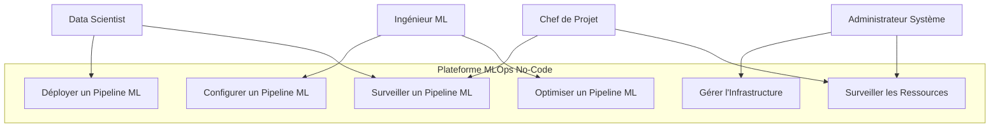

# Cas d'Utilisation et Scénarios d'Utilisation de la Plateforme MLOps No-Code

## Introduction

Ce document décrit les cas d'utilisation principaux de la plateforme MLOps No-Code Platform et les scénarios d'utilisation associés. La plateforme permet de déployer des pipelines ML de manière no-code sur différentes plateformes cloud.

## Acteurs

- **Data Scientist** : Utilise la plateforme pour déployer ses modèles ML.
- **Ingénieur ML** : Configure et optimise les pipelines ML.
- **Administrateur Système** : Gère l'infrastructure et le monitoring.
- **Chef de Projet** : Surveille l'état des déploiements et la consommation des ressources.

## Cas d'Utilisation

### Diagramme de Cas d'Utilisation

### UC-1 : Déployer un Pipeline ML

**Acteur Principal** : Data Scientist

**Description** : Le Data Scientist utilise l'interface no-code pour déployer un pipeline ML.

**Préconditions** :
- Le Data Scientist a accès à l'interface Windmill.
- Le Data Scientist a une configuration de pipeline prête.

**Scénario Principal** :
1. Le Data Scientist accède à l'application "ML Pipeline Builder" dans Windmill.
2. Il configure le pipeline en remplissant le formulaire (nom, description, plateforme cible).
3. Il assemble les nodes du pipeline (source de données, prétraitement, modèle, déploiement).
4. Il clique sur "Déployer le Pipeline".
5. Le système valide la configuration.
6. Le système génère le code Terraform.
7. Le système déploie l'infrastructure.
8. Le système déploie le pipeline.
9. Le système notifie l'utilisateur de l'achèvement du déploiement.

**Scénarios Alternatifs** :
- **SA-1** : Configuration invalide
  1. Le système détecte une configuration invalide.
  2. Le système affiche un message d'erreur.
  3. Le Data Scientist corrige la configuration.
  4. Le processus reprend à l'étape 4 du scénario principal.

### UC-2 : Surveiller un Pipeline ML

**Acteur Principal** : Data Scientist, Chef de Projet

**Description** : L'utilisateur surveille l'état d'un pipeline ML déployé.

**Préconditions** :
- Un pipeline ML est déployé.
- L'utilisateur a accès à l'API Gateway ou à l'interface de monitoring.

**Scénario Principal** :
1. L'utilisateur accède à l'interface de monitoring.
2. Il sélectionne le pipeline à surveiller.
3. Le système affiche l'état du pipeline (statut, détails).
4. L'utilisateur peut voir les métriques de performance (temps de réponse, utilisation CPU/GPU, etc.).

### UC-3 : Configurer un Pipeline ML

**Acteur Principal** : Ingénieur ML

**Description** : L'Ingénieur ML configure un pipeline ML en détail.

**Préconditions** :
- L'Ingénieur ML a accès à l'interface Windmill.
- L'Ingénieur ML a les connaissances techniques nécessaires.

**Scénario Principal** :
1. L'Ingénieur ML accède à l'application "ML Pipeline Builder" dans Windmill.
2. Il configure les paramètres avancés du pipeline (exigences de calcul, variables d'environnement, etc.).
3. Il assemble les nodes du pipeline avec des paramètres spécifiques.
4. Il teste la configuration.
5. Il sauvegarde la configuration.

### UC-4 : Optimiser un Pipeline ML

**Acteur Principal** : Ingénieur ML

**Description** : L'Ingénieur ML optimise un pipeline ML existant.

**Préconditions** :
- Un pipeline ML est déployé.
- L'Ingénieur ML a accès aux métriques de performance.

**Scénario Principal** :
1. L'Ingénieur ML analyse les métriques de performance du pipeline.
2. Il identifie les goulets d'étranglement.
3. Il modifie la configuration du pipeline (exigences de calcul, paramètres du modèle, etc.).
4. Il redéploie le pipeline.
5. Il surveille les nouvelles métriques de performance.
6. Il itère sur le processus jusqu'à l'optimisation souhaitée.

### UC-5 : Gérer l'Infrastructure

**Acteur Principal** : Administrateur Système

**Description** : L'Administrateur Système gère l'infrastructure sous-jacente.

**Préconditions** :
- L'Administrateur Système a accès aux outils d'administration (kubectl, terraform, etc.).
- L'Administrateur Système a les droits nécessaires.

**Scénario Principal** :
1. L'Administrateur Système surveille l'état de l'infrastructure.
2. Il identifie les problèmes potentiels (ressources insuffisantes, défaillances matérielles, etc.).
3. Il provisionne de nouvelles ressources si nécessaire.
4. Il met à jour les composants de l'infrastructure.
5. Il assure la maintenance préventive.

### UC-6 : Surveiller les Ressources

**Acteur Principal** : Administrateur Système, Chef de Projet

**Description** : L'utilisateur surveille l'utilisation des ressources de l'infrastructure.

**Préconditions** :
- Le monitoring Prometheus/Grafana est configuré.
- L'utilisateur a accès à l'interface de monitoring.

**Scénario Principal** :
1. L'utilisateur accède à l'interface Grafana.
2. Il sélectionne le dashboard approprié.
3. Le système affiche les métriques de ressources (CPU, mémoire, GPU, réseau, etc.).
4. L'utilisateur analyse les tendances d'utilisation.
5. Si nécessaire, il alerte les parties prenantes.

## Scénarios d'Utilisation Détaillés

### Scénario 1 : Déploiement d'un Chatbot RAG

**Contexte** : Une équipe de Data Scientists souhaite déployer un chatbot RAG (Retrieval-Augmented Generation) pour répondre aux questions des clients.

**Acteurs** :
- Data Scientist
- Ingénieur ML

**Étapes** :
1. Le Data Scientist configure le pipeline dans Windmill :
   - **Source de Données** : Base de connaissances en PDF.
   - **Prétraitement** : Découpage du texte en chunks, vectorisation.
   - **Modèle** : Modèle d'embedding (OpenAI Ada 002) et modèle de génération (GPT-4).
   - **Déploiement** : Point de terminaison API.
2. L'Ingénieur ML optimise les paramètres :
   - Sélection du modèle d'embedding le plus approprié.
   - Configuration du nombre de chunks à récupérer.
   - Optimisation de la taille du contexte.
3. Le pipeline est déployé sur Exoscale.
4. Le Data Scientist teste le chatbot via l'API.
5. L'Ingénieur ML surveille les performances et optimise si nécessaire.

### Scénario 2 : Fine-tuning d'un Modèle de Prédiction

**Contexte** : Une entreprise souhaite fine-tuner un modèle de prédiction pour ses ventes.

**Acteurs** :
- Data Scientist
- Ingénieur ML
- Administrateur Système

**Étapes** :
1. Le Data Scientist configure le pipeline dans Windmill :
   - **Source de Données** : Données de ventes historiques.
   - **Prétraitement** : Nettoyage des données, feature engineering.
   - **Modèle** : Fine-tuning d'un modèle pré-entraîné (par exemple, un modèle de série temporelle).
   - **Déploiement** : Traitement par lots.
2. L'Ingénieur ML configure le processus de fine-tuning :
   - Sélection des hyperparamètres.
   - Configuration du nombre d'époques.
   - Mise en place de la validation croisée.
3. Le pipeline est déployé sur RunPod pour l'entraînement intensif en GPU.
4. L'Administrateur Système surveille l'utilisation des ressources GPU.
5. Le modèle entraîné est déployé pour les prédictions.
6. Le Data Scientist évalue la performance du modèle.

### Scénario 3 : Déploiement d'un Modèle de Détection d'Anomalies

**Contexte** : Une entreprise de cybersécurité souhaite déployer un modèle de détection d'anomalies sur ses logs.

**Acteurs** :
- Data Scientist
- Ingénieur ML
- Administrateur Système
- Chef de Projet

**Étapes** :
1. Le Data Scientist configure le pipeline dans Windmill :
   - **Source de Données** : Flux de logs en temps réel.
   - **Prétraitement** : Extraction de features, normalisation.
   - **Modèle** : Modèle d'apprentissage non supervisé (par exemple, Isolation Forest).
   - **Déploiement** : Point de terminaison API avec alerting.
2. L'Ingénieur ML optimise le modèle :
   - Réglage des seuils de détection.
   - Configuration des alertes.
   - Mise en place d'un système d'apprentissage continu.
3. Le pipeline est déployé sur K3s local pour un contrôle total.
4. L'Administrateur Système configure le monitoring Prometheus/Grafana.
5. Le Chef de Projet surveille les alertes et les performances.
6. Le système est mis à jour régulièrement avec de nouvelles données.

## Conclusion

La plateforme MLOps No-Code Platform permet de couvrir un large éventail de cas d'utilisation dans le domaine du Machine Learning, de la configuration simple de pipelines par des Data Scientists à l'optimisation avancée par des Ingénieurs ML, en passant par la gestion de l'infrastructure par des Administrateurs Système. Les scénarios présentés illustrent la flexibilité et la puissance de la plateforme pour répondre aux besoins variés des équipes ML.